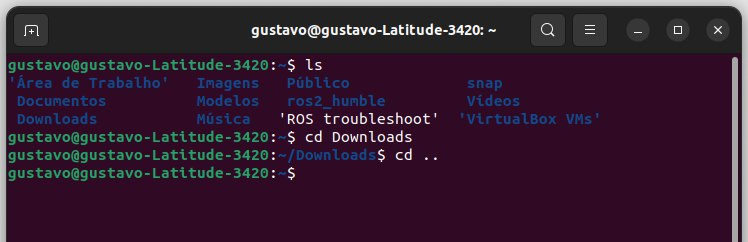
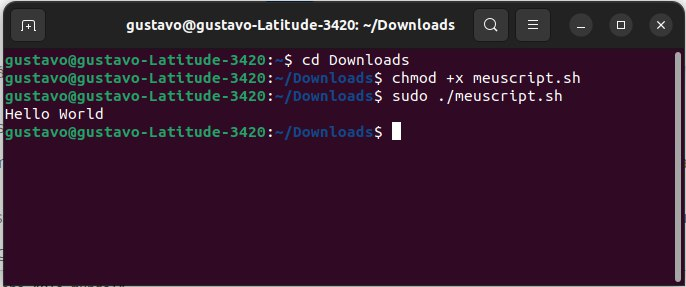

# Conceitos iniciais

Antes de qualquer outro guia da **Robo Connection**, é importante entender alguns conceitos importantes sobre **Terminal do Linux e Scripts**. Esses conceitos servirão como ferramentas na conclusão de passos importantes para a programação do NAO.

    

## 1. Conceitos iniciais sobre o terminal do Linux

O **terminal** ou **linha de comando** do Linux é a interface onde os comandos de controle do sistema serão inseridos. Através dele, podemos **instalar, desinstalar e atualizar** programas, além de podermos **navegar** pelos diretórios do sistema.

**Como um computador funciona?**

O computador sempre **executa códigos na linha de comando**. Quando clicamos em botões e funcionalidades na tela, um processo acontece através de comandos que rodam no terminal sem que saibamos. Isso traz comodidade ao usuário, que nem sempre deseja saber o que ocorre **por trás dos panos**.

**Usando o terminal:**

Para abri-lo, aperte simultaneamente `CTRL`+`ALT`+`T`.

Uma tela semelhante a essa se abrirá: 

    

No terminal de exemplo acima:
 
* `gustavo@gustavo-Latitude-3420` (em verde): identifica o usuário e o apelido da máquina usada, respectivamente;
* `~` (em azul): indica o diretório atual. No terminal, '~' equivale ao diretório `/home/usuario/`.

Um diretório nada mais é do que uma pasta. Todo diretório ou arquivo possui um caminho. **Mas o que isso significa**?
Isso significa que, se navegarmos por esse caminho, podemos chegar ao arquivo em questão.

**Por exemplo**: se quero chegar ao diretório `/home/usuário/`, posso sair de `/`, acessar `/home/` e depois acessar `/home/usuário/`.

**Conhecendo o pip**:

O **pip** é o instalador de pacotes do Python. Através dele, podemos instalar pacotes que usaremos na programação do NAO.
A sintaxe de uso do pip para instalação de programas é `pip install <pacote>`.

---

Em suma, o terminal permite a execução de programas de diversas linguagens, instalação de pacotes, edição de texto, dentre outras possibilidades.

### Comandos básicos do terminal Linux

**Comando `ls`: listando arquivos**

Para ver os arquivos presentes na pasta atual, podemos digitar o comando `ls`. Essa ação irá gerar uma lista de arquivos e pastas que se encontram no diretório atual.

**Por exemplo**:

    

No exemplo acima, usamos o comando `ls` no diretório `~` (no caso, `/home/gustavo/`). Isso gerou uma lista de arquivos presentes nesse diretório.

Note também que os arquivos em azul são diretórios (pastas). O arquivo em branco possui outro formato. 

**Comando `cd`: navegando entre diretórios**

Para navegar entre diretórios no terminal Linux, usamos o comando `cd <diretório>.` Para voltarmos para o diretório "mãe", usamos o comando `cd ..`.

**Por exemplo**:

    

No exemplo acima, usamos o comando `ls` para listar os arquivos em `~`. Depois, usamos `cd Downloads` para acessar o diretório `~/Downloads/`. Em seguida, usamos o `cd ..` para retornarmos para o diretório "mãe". Ou seja, voltamos para `~`.

Assim, podemos usar o terminal do Linux para navegar em qualquer diretório do sistema.

> Nota: para acessar diretórios com nomes que contenham espaços (como "Área de Trabalho"), sempre use aspas. Se quero acessar `~/Área de Trabalho/`, devo usar o comando `cd ~/'Área de Trabalho'`

**OBS.:** Podemos acessar caminhos mais profundos de uma vez usando o comando `cd`.

**Por exemplo**: dentro de `~` existe o diretório `Downloads`. Dentro de `Downloads` existe um diretório de nome `Exemplo`. Portanto, o caminho desse diretório é `~/Downloads/Exemplo`. 

Para chegarmos em `~/Downloads/Exemplo`, não precisamos acessar pasta a pasta. Podemos acessá-lo de qualquer diretório simplesmente usando o comando `cd ~/Downloads/Exemplo`.

    

No exemplo acima, estávamos no diretório `~/Área de Trabalho/`. Usando o comando `cd ~/Downloads/Exemplo`, acessamos esse diretório diretamente.

**Comando `clear`: limpando o terminal**

Podemos usar esse comando para limpar o terminal. Basta digitar `clear` na linha de comando e apertar `ENTER`. Com isso, o terminal será limpo. Isso não muda o diretório atual.

## 2. Conceitos básicos sobre scripts

**O que são scripts?**

    

**Scripts** são instruções em sequência que executam alguma ação. Geralmente, utilizam um **_shell_** para executarem tais ações.
Um **shell** é uma ponte entre o usuário e o sistema operacional. Através do shell, o usuário acessa as funcionalidades do sistema operacional. Um shell pode ser de dois tipos:

1. **CLI (Command Line Interface)** - São interfaces em que podemos **digitar códigos** e ações serão executadas, assim como o Terminal do Linux ou outros ambientes de desenvolvimento.
2. **GUI (Graphical User Interface)** - São interfaces que possuem **recursos visuais (botões, campos, etc.)** para executar ações. Um exemplo é o Windows Explorer, da Microsoft.

Assim, no seguimento dos tutoriais da **Robo Connection**, utilizaremos o **Bash** como linguagem de comando, sendo este o shell CLI padrão do Linux.

Os scripts bash possuem a extensão **".sh"**. 

**Ok, mas como executar um script?**

Suponha que queremos executar um script que está em `~/Downloads/`. Seu nome é `meuscript.sh`. Esse script imprime **"Hello World"** na tela.

Para executar o script, precisamos seguir os seguintes passos:

1. Vá até o local do script usando o comando `cd`. No caso, usamos `cd ~/Downloads/`.
2. **(Recomendado)** Use o comando ls para pegar o nome do script corretamente. Erros de escrita no nome do script resultarão em erro.
3. Permita a execução do script como um programa. Para isso, execute o comando `chmod +x <nome_do_script>`. No exemplo, usamos `chmod +x meuscript.sh`.
4. Execute o script como _superuser_. Para fazer isso, utilize o comando `sudo ./<nome_do_script>`. No exemplo, usamos `sudo ./meuscript.sh`.
5. Com esses passos, o script será executado na sua máquina:

    

> Nota: a permissão de **_superuser_ (ou _sudo_)**  é análogo ao ato de executar um programa como administrador (Windows). Isso garante que não haverão falhas de permissão na execução do programa. **Alguns programas exigirão** a permissão _sudo_ para serem executados.

### Se você chegou até aqui, **parabéns**! Você está apto a prosseguir com os guias da **Robo Connection**!
