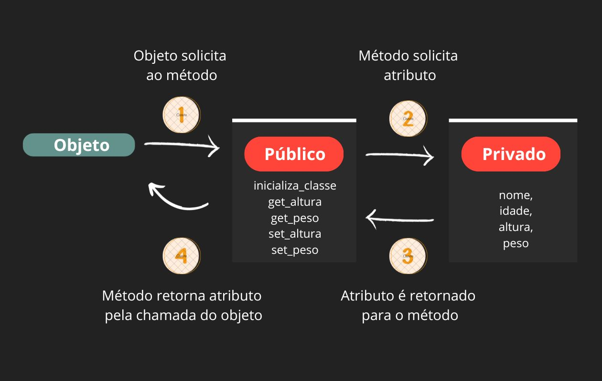

# Introdução à programação orientada a objetos em C++
---

## O que é o C++

A **linguagem de programação C++** é uma extensão à linguagem **C**. Através dessa extensão, a programação orientada a objetos se tornou possível.

Em comparação ao Python, a linguagem C (e, consequentemente, o C++) é bem mais rápida em tempo de execução. Isso significa que um código para o NAO feito em Python vai ser executado pelo robô muito mais lentamente em comparação ao mesmo código em C++. Entretanto, o C++ possui uma sintaxe um pouco mais complicada e minuciosa em comparação ao Python.

<center>


</center>

## O que é Programação Orientada a Objetos (POO)?

A orientação a objetos é um **paradigma de programação**. Para que você entenda melhor, faremos uma analogia. É como se fosse um video-game. Se você criasse um console de video-game, construiria um aparelho com diversos **atributos**, como os circuitos internos, que **não devem ser acessados pelo usuário (privado)**. Em contrapartida, disponibilizaria **métodos** de acesso às funcionalidades do video-game pelo usuário **(público)**, como botões em um _joystick_ que o controla.

A esse conceito damos o nome de **interface**. Uma interface nada mais é do que a "casca" que isola os componentes internos (como os circuitos internos) e os componentes externos do software (como o joystick, no exemplo). Internamente, a interface possui partes que devem estar privadas ao usuário. Externamente, possui partes que podem ser usadas pelo usuário, ou seja, estão públicas.

<center>


</center>

Em relação às permissões de uso, damos o nome de **encapsulamento**. Podemos ter o **encapsulamento privado** (apenas o video-game controla suas partes internas, e não o usuário) e o **encapsulamento público** (o usuário controla as partes internas do video-game pelos botões da interface). Além desses dois tipos, possuímos o **encapsulamento protegido**, que não está no escopo desse guia.

## O que é uma classe? O que são objetos?

Uma **classe** é uma estrutura essencial quando tratamos de POO. Usaremos um exemplo para tornar esse conceito mais claro. Se considerarmos uma classe **Pessoa**, podemos pensar em atributos (dados) que todas as pessoas têm. Todas as pessoas possuem um nome, uma idade, uma altura e um peso. Esses serão os atributos da nossa classe `Pessoa`.

Um **objeto** é uma instância da classe. Mas o que isso significa na prática? Se temos a classe `Pessoa`, posso criar um objeto chamado `pessoa1` da classe `Pessoa`, que tenha nome "João", idade 33, altura 1,78m e peso 82,5kg. Em outras palavras, um objeto que instancia a classe `Pessoa` é um exemplar da classe `Pessoa`. Assim, o objeto terá os atributos exigidos pela classe, além de ter acesso aos métodos que estão nessa classe. Uma classe define, portanto, os atributos e métodos dos objetos que a instanciarão.

<center>


</center>

Resgatando a analogia do **video-game**, o objeto é o _joystick_, plataforma pela qual o usuário acessará e manipulará, **indiretamente**, os atributos da classe (**circuito interno do video-game**), que estão privados ao usuário. A classe, por sua vez, representa todo o video-game.

> Obs.: Em uma classe, os atributos devem ser privados (não acessíveis ao usuário).

Para construir uma classe `Pessoa` que possua os atributos acima, podemos utilizar o C++ da seguinte forma:

```cpp
#include <iostream>
using namespace std;

class Pessoa{
    // Aqui vamos colocar os atributos da classe
    // Usamos "private" para declarar encapsulamento privado
    private: 
        char nome[50];
        int idade;
        float altura;
        float peso;
       
    // Aqui vamos colocar os métodos da classe    
    // Usamos "public" para declarar encapsulamento público
    public: 
        void inicializa_classe(char* name, int age, float height, float weight){
            nome = name;
            idade = age;
            altura = height;
            peso = weight;
        };
};

int main(void){
    Pessoa pessoa1;
    
    // Abaixo, colocamos os valores passados como parâmetros nos atributos de pessoa1
    pessoa1.inicializa("João", 33, 1.78, 82.5);
    
    return 0;
}
```

Na parte **privada** da classe `Pessoa`, **definimos os atributos** (também chamados de membros). Na parte **pública**, criamos um método `inicializa` que **coloca valores nos atributos**.

Em seguida, na função main, criamos o objeto `pessoa1` da classe `Pessoa`. Através desse objeto, utilizamos o método `inicializa`, definido dentro da classe `Pessoa` como um método público, ou seja, o usuário pode utilizar através do objeto.

A sintaxe para utilizar um método através do objeto de uma classe em C++ é: `objeto.metodo(parametro1, parametro2, ...)`. Nesse caso, utilizamos `pessoa1.inicializa("João", 33, 1.78, 82.5)`.

**Ok, mas o que podemos fazer com os atributos?**

Para responder essa questão, temos que analisar as especificidades de nossa classe. No caso de `Pessoa`, suponha que estamos usando essa classe para cadastrar pessoas em um sistema de uma rede de academias. Cada pessoa cadastrada deverá ter seu nome, idade, altura e peso registrados para melhor acompanhamento.

Além de armazenar informações, podemos utilizar a POO para realizar operações utilizando os atributos. A classe `Pessoa` pode, por exemplo, ter um método que calcule e imprima o IMC dos clientes da academia, baseada nos atributos. Um outro método poderia calcular uma previsão de peso corporal caso a pessoa frequente a academia por certo período.

Assim, fica claro que a POO pode ajudar bastante na organização de sistemas. O NAO utiliza esse paradigma para organizar suas classes e métodos, realizando operações no robô através de objetos de classes diversas.


**Getters e Setters**

Exemplo:

Maria, de 19 anos, foi cadastrada com 1.60m de altura e 63kg de peso. Porém, após o primeiro mês de academia, Maria perdeu 3kg. Além disso, mediu sua altura novamente e percebeu que possuía, na verdade, 1.62m de altura.

Portanto, precisamos mudar esses atributos no objeto de Maria. Porém, os atributos são privados na classe `Pessoa`. Isso significa que o objeto não pode acessar diretamente os atributos da classe. Por conta disso, precisamos de um método público dentro da classe, que possa mudar esses atributos. 

Dessa forma, o objeto **NÃO** está acessando **diretamente** o atributo da classe, mas sim **indiretamente**, **através de um método** que, por sua vez, acessa diretamente esses atributos, evitando problemas de permissão.

Observe o esquemático a seguir:

<center>



</center>

Faremos isso utilizando **getters e setters**. Os métodos **get** e **set** são muito usadas na POO. Mas não se assuste, são métodos como qualquer outro. A única diferença é que nomeamos os métodos dessa forma padronizada. Esses métodos serão os mediadores entre o objeto e os atributos. Confira a seguir o seu uso:

- **get**: retorna o valor de um atributo. Exemplo: `nome = objeto.get_nome()`.
- **set**: muda o valor de um atributo. Exemplo: `objeto.set_idade(20)`.

1. No exemplo do **get**, colocamos na variável "nome" o valor retornado pelo método get_nome() de `objeto`. 
2. No exemplo do **set**, colocamos o atributo "idade" no valor 20, através do parâmetro inserido.

Então, para resolvermos o problema de Maria, cujos dados estão errados, basta utilizarmos métodos setters e getters para consertarmos, certo? Vamos fazer isso no bloco de código a seguir:

**Parte pública da classe `Pessoa`:**

```cpp
    public:
        void inicializa_classe(char* name, int age, float height, float weight){
            nome = name;
            idade = age;
            altura = height;
            peso = weight;
        };
       
        float get_altura()
            return altura;
       
        float get_peso()
            return peso;
       
        void set_altura(float h)
            altura = h;
       
        void set_peso(float w)
            peso = w;
```

Assim, completamos o seguinte diagrama para a classe `Pessoa`:

<center>


</center>

**Programa principal:**

```cpp
int main(void){
    Pessoa maria;
   
    maria.inicializa("Maria", 19, 1.60, 63); // valores antigos

    cout << "A altura de Maria atualmente e: " << maria.get_altura() << endl;
    cout << "O peso de Maria atualmente e: " << maria.get_peso() << endl;
   
    maria.set_altura(1.62); // arrumando altura
    maria.set_peso(60); // arrumando peso
   
    cout << "A nova altura de Maria e: " << maria.get_altura() << endl;
    cout << "O novo peso de Maria e: " << maria.get_peso() << endl;
   
    return 0;
}
```

> Aqui, mostramos apenas a parte **pública** da classe e o **programa principal**, para fins didáticos. O resto da classe (parte privada) ainda existe!

## Fim do tutorial! Parabéns!

_Mas e agora, qual é o próximo passo?_

Para programar o NAO, é necessário que você entenda os conceitos apresentados nesse guia. **O NAO utiliza métodos que pertencem a classes definidas pelos desenvolvedores do robô**.

Além disso, você também pode criar **novas classes** com métodos que podem, inclusive, utilizar métodos de outras classes.

Dessa forma, o(a) incentivamos a continuar aprofundando seus estudos em POO (faça cursos para se aprofundar!), na interface do NAO e no SDK (Software Development Kit) do NAO (consulte nossos guias).

## Dicas importantes para uso prático do NAO (Avançado):

- O NAO (v4) tem pouca memória e processador fraco, o que significa que deve-se limitar o uso de herança;
- Lembre-se de usar shared_ptr para evitar vazamento de memória;
- O NAO (v4) usa C++98, portanto depende muito mais da Boost para funcionalidades básicas;
- O NAO (v6) tem o C++11, usando muitos conteúdos que já estão na biblioteca padrão.
- O Robo Connection auxilia o usuário a contornar várias "pegadinhas" do C++ nos exemplos do NAOv4. Muitas coisas podem confundir usuários do Java, principalmente na burocracia em relação ao uso dos atributos **static** e **const**.
