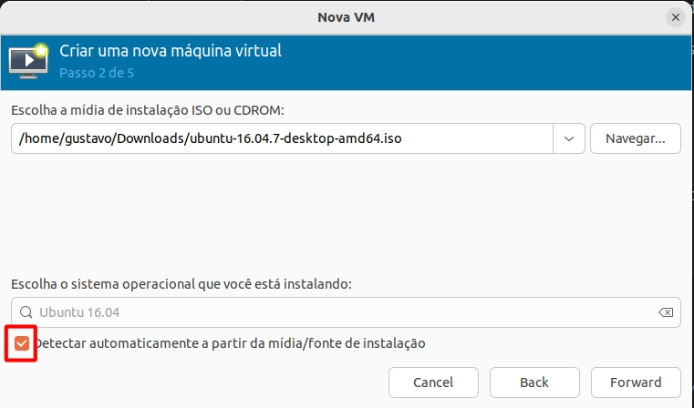
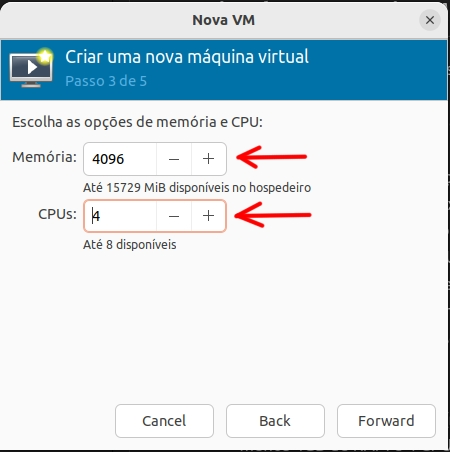
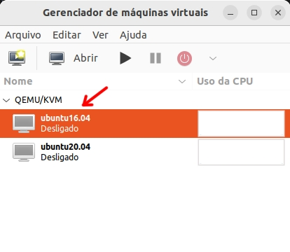
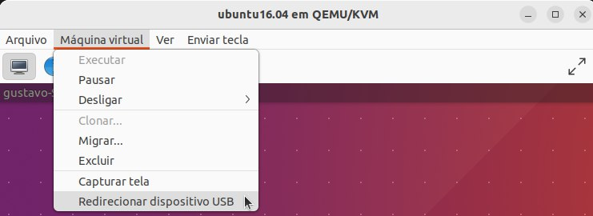

# Instalação de Máquina Virtual com Virt Manager
---

<div align=center>
    
</div>

Os robôs NAO utilizam diversos programas para configuração, programação e manutenção. Porém, esses programas são compatíveis com diferentes versões do sistema Linux.

Para que não seja necessário utilizar muitas máquinas, utilizaremos apenas uma máquina com diversas máquinas virtuais (VMs) disponíveis para rodar no sistema com o gerenciador Virt Manager (cada máquina virtual com um sistema operacional diferente, para que sejam acessados os diversos programas em uma mesma máquina física).

Para ilustrar a diferença dos sistemas operacionais necessários na operação dos NAOs, observe a tabela abaixo, onde são mostrados programas comuns usados na programação dos NAO v6.

<center>

| Programa | Sistema Compatível |
|---|---|
| Robot Settings 2.8.6 | Ubuntu 16.04 |
| Choregraphe 2.8.6 | Ubuntu 16.04 |
| NAOqi SDK 2.8.5 (C++ - V6)| Ubuntu 16.04 |
| NAOqi SDK 2.1.4 (C++ - V4)| Ubuntu 12.04 |
| ROS1 | Ubuntu 20.04 |
| ROS2 | Ubuntu 22.04 |

</center>

> O NAO v4 utiliza diferentes versões desses programas, com sistemas operacionais também diferentes, em alguns casos. Para mais informações, consulte o [Developer Center da Aldebaran Robotics](https://www.aldebaran.com/developer-center/index.html).

O Virt Manager é o programa no qual as VMs estarão acessíveis, tornando possível criar, excluir e modificar VMs. Além disso, o Virt Manager permite o compartilhamento de portas USB entre máquina real e virtual e a criação de _snapshots_ (pontos de controle), que funcionam como um recurso de back-up rápido caso estejamos testando diferentes funcionalidades que podem corromper o sistema das VMs.


## Requisitos

- Ubuntu 22.04 (Jammy Jellyfish) instalado na máquina física
- Cópia baixada da ISO do Ubuntu (versão desejada)
- Ao menos 50GB de espaço livre no disco rígido
- Ao menos 8GB de RAM
- Processador compatível com aceleração baseada em KVM

### Verificando compatibilidade

Para verificar a compatibilidade do processador, pode-se executar o comando `kvm-ok` do pacote `cpu-checker` como _superuser_.

```
sudo apt update
sudo apt install cpu-checker
sudo kvm-ok
```

## Instalando dependências necessárias

Para instalar as dependências necessárias, execute o seguinte código em terminal:

```
sudo apt update
sudo apt install qemu-system-x86
sudo apt install qemu-system-gui
sudo apt install qemu-utils
sudo apt install qemu-block-extra
sudo apt install ovmf
sudo apt install libguestfs-tools
sudo apt install virt-manager
```

**Habilitando o libvirtd**

```
sudo systemctl start libvirtd
sudo systemctl enable libvirtd
```

> Obs.: necessário reiniciar o sistema após esse passo.

## Criando VM no Virt Manager

- No navegador de aplicativos do Ubuntu, procure e execute o Virt Manager
- Na aba arquivo, selecione a opção "Nova máquina virtual"

<div align=center>
    
</div>

- Selecione "Mídia de instalação ISO ou CDROM" e clique em `Forward`. No próximo menu, clique em `Navegar` e procure a opção `Navegar localmente`

<div align=center>
    
</div>

- Selecione o arquivo ISO do Ubuntu, deixe marcado "Detectar automaticamente a partir de mídia(...)" ou selecione a versão desejada manualmente

<div align=center>
    
</div>

- Caso apareça uma prompt sobre permissão de acesso, clique em `Sim`
- No próximo menu, separe a memória e o número de CPUs desejados para a VM (recomendação: deixe pelo menos 4GB de RAM e 4 CPUs para seu computador físico)
- Marque a opção "Habilitar armazenamento para esta máquina virtual" e reserve o espaço desejado (recomendação: pelo menos 20GB)

<div align=center justify-content=center>
    
    
</div>


- Dê um nome para a VM (use nomes simples para melhor manipulação)
- Clique em `Concluir` para criar a VM

<div align=center>
    
</div>


## Iniciando a VM

Para iniciar a VM, clique duas vezes sobre a listagem da VM no menu principal do Virt Manager.

<div align=center>
    
</div>

Em seguida, clique no botão indicado para inicializar a máquina virtual selecionada:

<div align=center>
    
</div>

## Instalando Ubuntu na VM

> A presente seção do tutorial se refere à uma instalação genérica de sistemas Ubuntu Linux. Caso seja necessário, consulte um guia de instalação da sua versão.

Com a VM iniciada, realize a instalação do Ubuntu normalmente:

- Com o idioma desejado selecionado, clique em `Instalar o Ubuntu`
- No menu "Preparando para instalar o Ubuntu", deixe a opção "Baixar atualizações enquanto instala o Ubuntu" marcada
- Em "Tipo de instalação", marque "Apagar disco e reinstalar o Ubuntu"
- Clique em `Instalar agora` e em seguida em `Continuar`
- Selecione o fuso local (se você está em Brasília, selecione o fuso "Sao Paulo")
- Selecione o teclado desejado (recomendação: deixar na configuração padrão)
- Preencha os campos de acordo com suas informações
- Clique em `Continuar` e aguarde até o fim da instalação
- Clique em `Reiniciar agora`

> **Obs.**: após o reinício pós-instalação, é comum as VMs travarem. Se for o caso, no menu superior do Virt Manager há um botão vermelho com uma seta ao lado. Clique na seta e selecione "Forçar desligamento". Confirme e depois reinicie a VM no botão de _start_.


## Snapshots

_Snapshots_ são pontos de controle da máquina virtual. Para exemplificar, imagine o seguinte exemplo: você precisa instalar um programa instável, e ele pode corromper seu sistema.

Para impedir isso, você cria um snapshot antes de instalar o programa. Se, durante a instalação do programa, ocorrer algum problema com seu sistema, você pode acessar o snapshot para voltar ao estado da máquina correspondente ao momento em que você criou o snapshot (antes de instalar o programa) e tomar as medidas necessárias para evitar a reincidência do erro.

### Criação de snapshots

Para criar os snapshots, siga os passos abaixo:

- Certifique-se de que o Virt Manager esteja sendo executado com uma VM aberta
- No menu acima (na janela da VM), existe um botão com o ícone de duas telas de computador (Gerenciar os snapshots da VM), clique nele.

<div align=center>
    
</div>

- No canto inferior esquerdo, clique no botão com sinal de "+" (Criar novo snapshot)

<div align=center>
    
</div>

- Dê um nome ao snapshot (sem espaços) e adicione uma descrição
- Clique em `Concluir` para finalizar a criação do snapshot

### Utilização dos snapshots

Para acessar os snapshots criados, siga os passos abaixo:

- Certifique-se de que o Virt Manager esteja sendo executado com uma VM aberta
- No menu acima (na janela da VM), abra novamente o menu de snapshots com o botão    
- No navegador à esquerda, selecione o snapshot desejado
- No canto inferior esquerdo, clique no botão com ícone de seta (Executar snapshot selecionado)

<div align=center>
    
</div>

- Clique em `Sim` para confirmar e retornar ao snapshot selecionado

## Portas USB

É possível utilizar as portas físicas da sua máquina em uma máquina virtual. Exemplificando, posso conectar uma Raspberry Pi no meu sistema físico e utilizá-lo na máquina virtual com o Virt Manager.

Para isso, siga os passos a seguir:

- Certifique-se de que o Virt Manager esteja sendo executado com uma VM aberta
- Certifique-se de conectar o dipositivo desejado na porta USB da sua máquina física
- No menu superior da janela da VM, clique na aba `Máquina Virtual`
- Selecione a opção `Redirecionar dispositivo USB` e selecione o dispositivo inserido

<div align=center>
    
</div>

- Confira no sistema da VM se o dispositivo foi adicionado