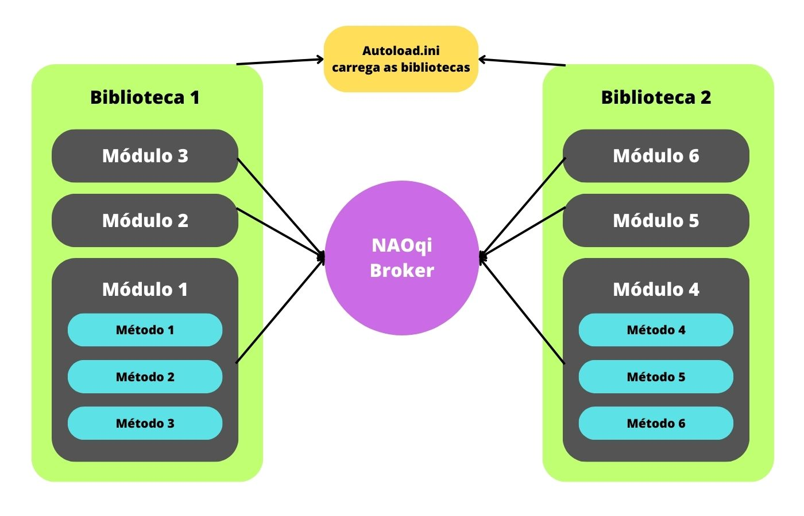

# NAOqi Framework - Overview

Este é um guia de apresentação de conceitos-chave do framework NAOqi, conhecimento necessário para o início na programação dos robôs da **Aldebaran Robotics**.


## O que é?

**NAOqi**: principal software usado no robô para controlá-lo.

**NAOqi Framework**: é um framework que funciona como um **_broker_** (intermediário). Isso significa que ele interliga diversos módulos. Suponha que você precise programar uma ação específica fora das ações comuns de fábrica do robô. Para isso, o NAOqi utiliza um sistema que resgata os módulos disponíveis (inclusive módulos criados por você, que contenha as funções específicas que você precisa) e os disponibiliza em sua aplicação.

## Principais características

**Multiplataforma**: disponível no Windows, Linux e MacOS

**Linguagens aceitas**:

- **Python**: o código criado roda diretamente no robô, porém é mais lento em termos de velocidade de execução, tornando o robô menos responsivo;
- **C++**: o código criado precisa ser compilado para o SO alvo. É necessário usar uma ferramenta de cross-compilação para gerar um código que rode no sistema operacional do robô - o NAOqi SO. Entretanto, a programação em C++ possibilita a criação de um código muito mais rápido em termos de velocidade de execução, tornando o robô mais responsivo.

<div align="center">
    
    
</div>

## Conceitos-chave:

**Métodos ou funções:** conjunto de instruções a serem realizadas.

**Módulo:** conjunto de métodos, funciona como uma classe.

**Biblioteca:** conjunto de módulos.

**Proxy:** ao criar um proxy de determinado módulo, é possível acessar os métodos desse módulo através do proxy. Funciona como um objeto de uma classe.

**NAOqi Broker**: é um intermediador dos módulos. Por exemplo: o módulo A, em um de seus métodos, precisa de um método do módulo B. O broker "avisa" o módulo A da existência do módulo B, possibilitando o acesso desejado.

**Autoload.ini**: arquivo localizado no SO do robô, responsável por carregar as bibliotecas quando o robô é iniciado.



**Módulos locais:**  Estão em um mesmo ambiente (processo), e portanto podem compartilhar variáveis e métodos com outros módulos locais. Além disso, apenas um broker é necessário para a conexão entre módulos locais, não precisando de internet para tal conexão. É bem mais rápido que a conexão remota entre módulos.

**Módulos remotos:** módulos que utilizam seu broker para se comunicar com outro broker que possui outros módulos. Utilizam a internet para se comunicarem (um broker precisa saber a porta e o IP do outro broker para trocarem informações). Possui velocidade menor em comparação com módulos locais.

## Mecanismos importantes

**Conexão entre módulos remotos**: imagine dois módulos remotos, A e B. A conexão entre eles pode ser **broker x broker** ou **proxy x broker** (objeto de A acessa B mas B não acessa A).

- **Conexão broker x broker**: nesse tipo de conexão, A acessa B e B acessa A. Ou seja, trata-se de uma comunicação recíproca. Para conectar módulos dessa maneira, basta especificar o IP e a Port (usando –pip e –pport na inicialização do módulo). Então, pode-se criar o proxy (objeto do módulo) com ```AL::ALProxy proxy = AL::ALProxy(nome_módulo)``` (em C++) para acessar os métodos desse módulo. Como o IP e a Port já foram especificados com –pip e –pport, não é necessário informar esses na criação do proxy. 

- **Conexão proxy x broker**: nesse tipo de conexão, A acessa B, mas B não tem acesso a A. Um módulo (classe) pode se comunicar com outro módulo através da instanciação de seu proxy (objeto). Suponha que o broker de A (que possui o módulo A) se conecta com o broker de B (que "avisa" sobre a existência de B). O proxy de A consegue utilizar os métodos de B através do broker de B, mas os módulos registrados nesse broker (B) NÃO possuem acesso ao módulo (A) que possui esse proxy. Sendo assim, trata-se de uma comunicação de acesso unilateral.

1. Criar um nome, usar um IP e uma porta.
2. Criar um broker usando essas informações
3. Criar um proxy do módulo A com o primeiro parâmetro sendo o broker B, e usando o nome do módulo A como segundo parâmetro

Os passos estão exemplificados aqui:

```
// Um broker precisa de um nome, um IP e uma porta para "escutar":
const std::string nomeBroker = "mybroker";

// IP do NAOqi
const std::string pip = "127.0.0.1"; // local NAOqi

// Porta do NAOqi
int pport = 9559;

// Crie o seu próprio broker
boost::shared_ptr<AL::ALBroker> broker = AL::ALBroker::createBroker(nomeBroker, "0.0.0.0", 54000, pip, pport);
AL::ALProxy proxy = AL::ALProxy(broker, <nome_do_modulo>);
```

**Chamadas bloqueadoras e não bloqueadoras**

Para chamar um método de um módulo, o NAOqi possibilita dois protocolos de chamadas:

- **Bloqueadoras**: chamada normal de um método. Instancia-se o objeto da classe e o utiliza usando a estrutura: ```modulo.metodo()```. Esse funcionamento é exatamente igual às chamadas normais de um método de uma classe.

- **Não bloqueadoras**: serve para chamar um método e, ao mesmo tempo, executar outras ações. Por exemplo: fazer o robô andar e falar ao mesmo tempo. Para isso, utiliza-se um “post object” de um proxy. Isso cria um processo que será executado paralelamente à outras atividades. Toda chamada que usa esse post object gera um TaskID, que pode ser usado para verificar se a tarefa está sendo ou já foi executada. Para criar uma chamada não bloqueadora, use a seguinte estrutura: ```modulo.post.metodo()```.

**ALMemory**

Essa ferramenta é a memória do robô. 

Todos os módulos podem ler (resgatar informações) ou escrever (registrar/alterar informações) na memória do robô. O ALMemory é um array de ALValues (valores do módulo ALValues podem ser de todos os tipos tradicionais encontrados na programação).

Para evitar problemas de acesso concorrente à memória (ações divergentes ao mesmo tempo no mesmo local da memória), eles utilizam critical sections de leitura/escrita para proteger o acesso, ou seja, os threads permitem a execução de apenas um processo por vez, enquanto os outros ficam suspensos até que o processo atual termine. Isso protege os dados.

Para que fique mais claro:

Suponha que existam dois métodos no mesmo ambiente, X e Y.

```
//Código X: 

a = 5
```

```
//Código Y:

a = 8
```

Se esses códigos forem executados ao mesmo tempo, a execução correta das ações posteriores pode ser prejudicada. Para evitar esse erro nas operações de leitura/escrita em memória, usa-se a _critical section_.