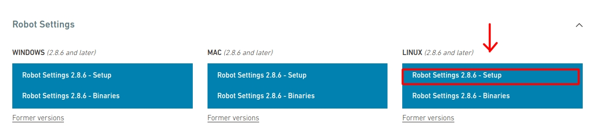

# Instalação do Robot Settings 2.8.6 (NAO v6) no Ubuntu 16.04
---

O Robot Settings 2.8.6 é um programa usado para configurar e gerenciar robôs NAO v6 da Softbank Robotics.

Entretanto, até o momento da criação desse tutorial, o Robot Settings 2.8.6 é compatível (em distribuições Ubuntu) apenas na versão **16.04 (Xenial Xerus)**.

## Requisitos

- Ubuntu 16.04 (Xenial Xerus)
- Ao menos 1 GB de espaço livre no disco rígido

## Instalando o Robot Settings

Os seguintes passos devem ser realizados dentro da VM com Ubuntu 16.04 ou em um sistema com Ubuntu 16.04 nativo.

### Download do Robot Settings 

- Abra o navegador
- Acesse o [Site da Aldebaran Robotics](https://www.aldebaran.com/en/support/nao-6/downloads-softwares)
- Abra a opção "Robot Settings"
- No sub-menu "Linux (2.8.6 and later)", clique sobre "Robot Settings 2.8.6 - Setup"
- Deixe selecionado "Save file" e clique em `OK`

<div align=center>
    
</div>

### Instalação do Robot Settings

Pressione `CTRL+ALT+T` para abrir o terminal. Execute os comandos abaixo:

```
cd ~/Downloads
chmod +x robot-settings-2.8.6.23-linux64-setup.run
sudo ./robot-settings-2.8.6.23-linux64-setup.run
```

Prosseguindo com a instalação:

- Clique em `Next` até que apareça o botão `Install`
- Clique em `Install`, aguarde a instalação e clique em `Finish`

Com a realização dos passos acima, o Robot Settings estará instalado e operante, podendo ser encontrado no menu de navegação do Ubuntu ou na área de trabalho.

> Cabe ressaltar que, como o Robot Settings **não é compatível com o Ubuntu 22.04**, deve-se sempre acessá-lo através da máquina virtual (com Ubuntu 16.04) gerenciada pelo Virt Manager, ou por uma máquina com Ubuntu 16.04 nativo para garantir a compatibilidade do sistema.
